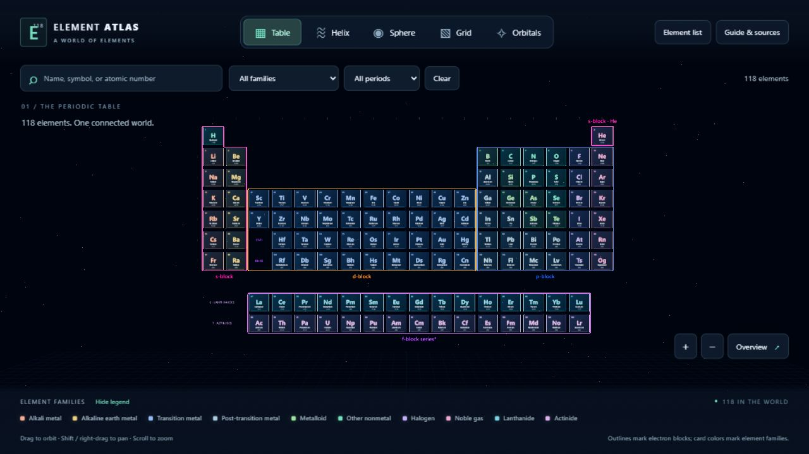
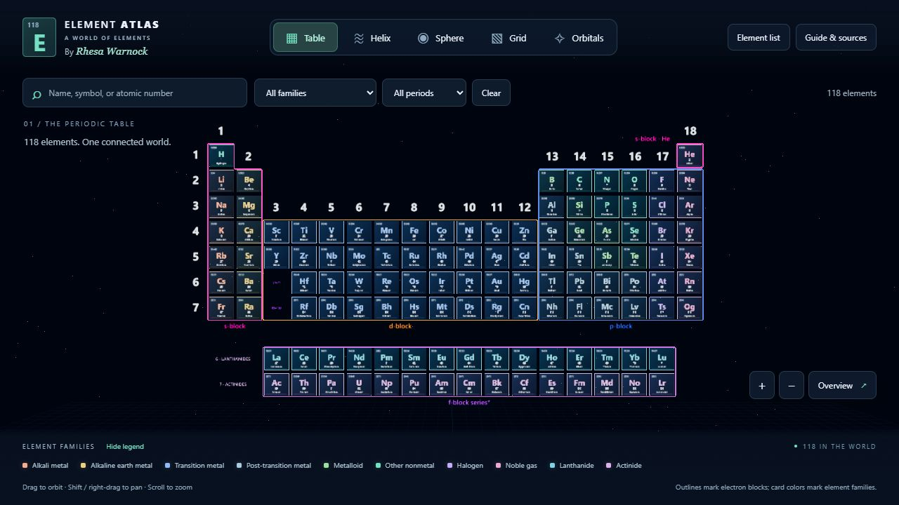
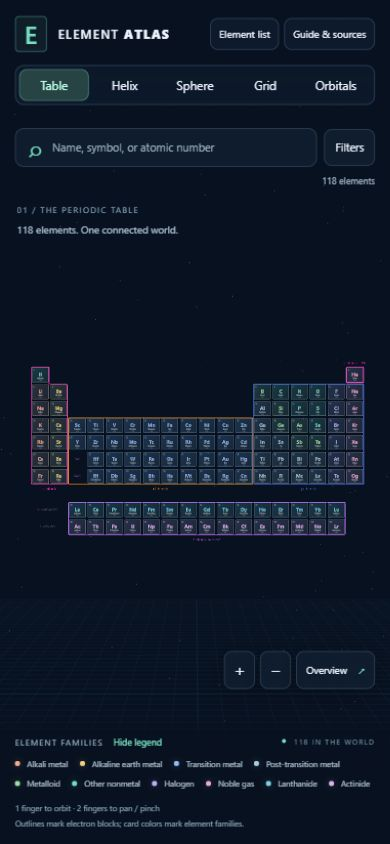
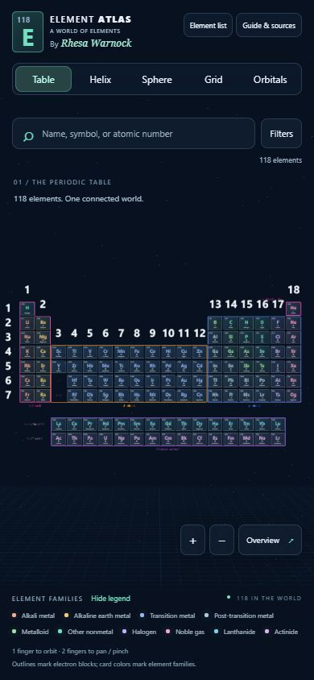
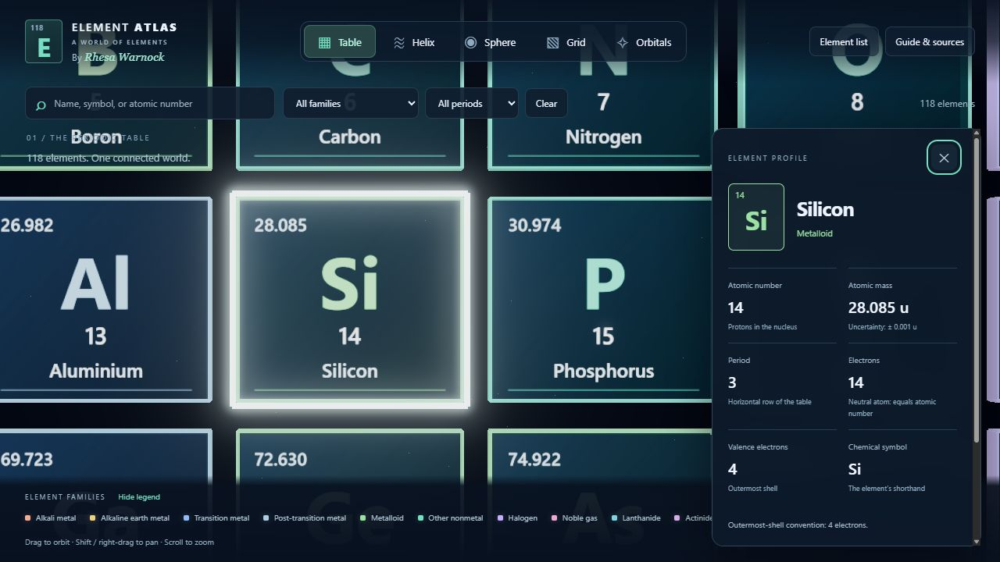
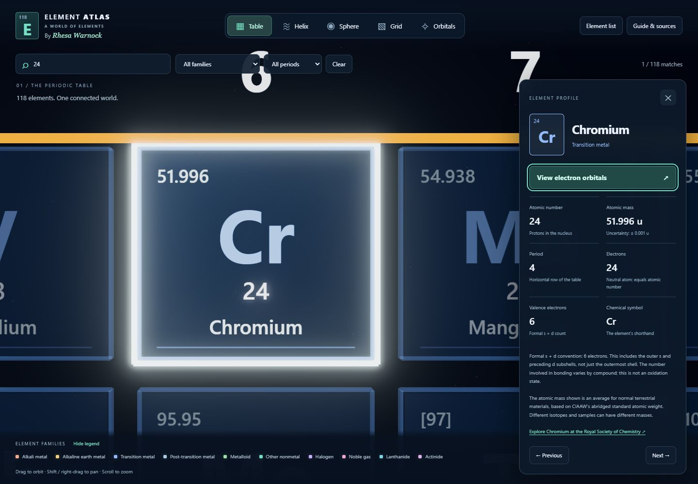
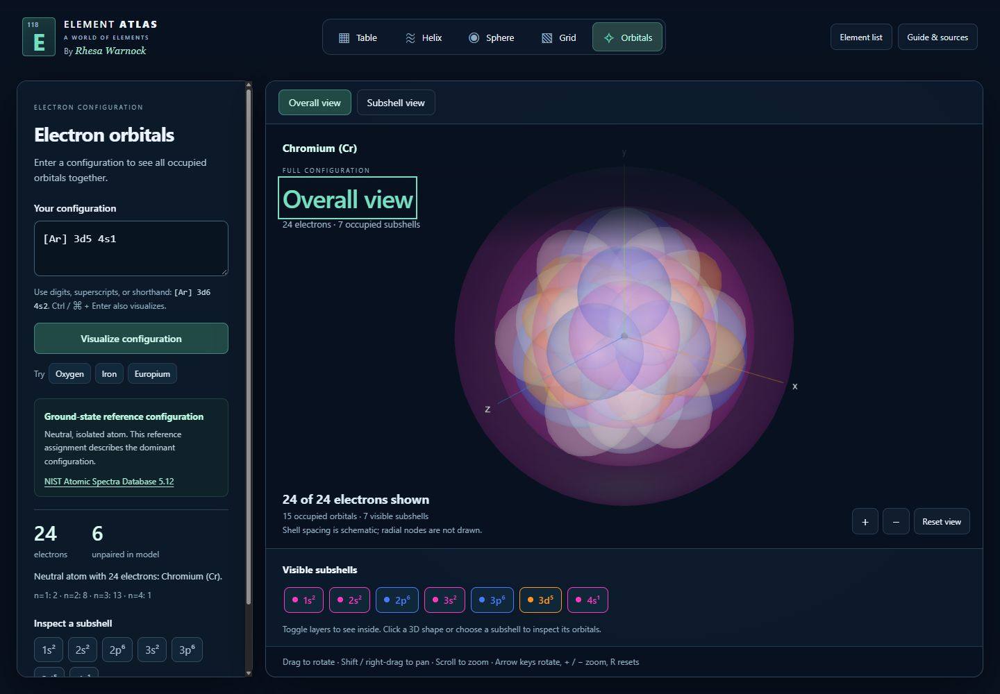
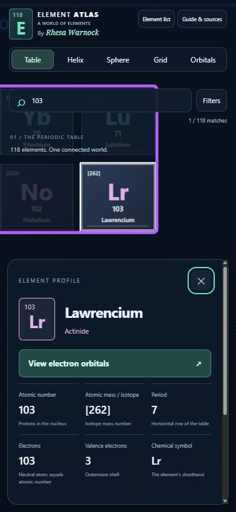
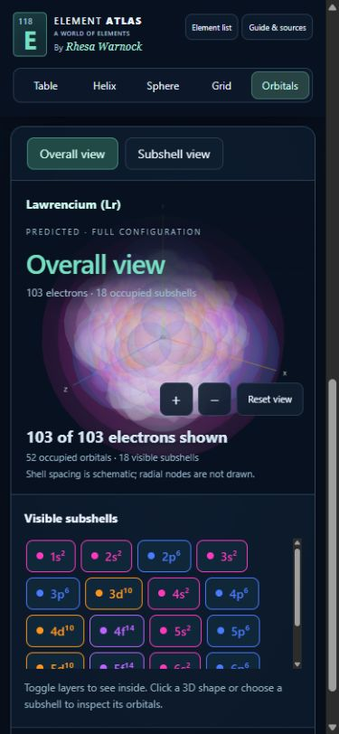

# Element Atlas presentation review

Baseline: commit `44972c176e00baf01bb333c909f158ed8eda6288`.

## Desktop — 1280 × 720

| Before | After |
| --- | --- |
|  |  |

## Phone — 390 × 844

| Before | After |
| --- | --- |
|  |  |

## Card information layout

Silicon shows the retained mass, central symbol, atomic number below the symbol, and name at the bottom. The scientific profile remains interactive.

## Other 3D arrangements

- [Helix](cards-after-helix.png)
- [Sphere](cards-after-sphere.png)
- [Grid](cards-after-grid.png)

The same front/back artwork is shared by all four arrangements. The full browser suite passed on desktop, tablet, phone, and a narrower 320 px phone viewport; see [verification](../../VERIFICATION.md).

## Element profile → Orbitals — 7 October 2026

The mint action opens the selected element's reference configuration in the existing Overall view. The imported identity and source stay visible during subshell inspection; valid manual edits clear that attribution. Table navigation restores the selected profile and camera.

| Profile action | Overall orbital view |
| --- | --- |
|  |  |

Phone previews show the accessible action and the prediction notice beside the model:

| Phone profile | Phone orbital view |
| --- | --- |
|  |  |

See [source documentation](../electron-configurations.md) and [verification](../../VERIFICATION.md). Screenshots are outside the published `dist/` directory.
